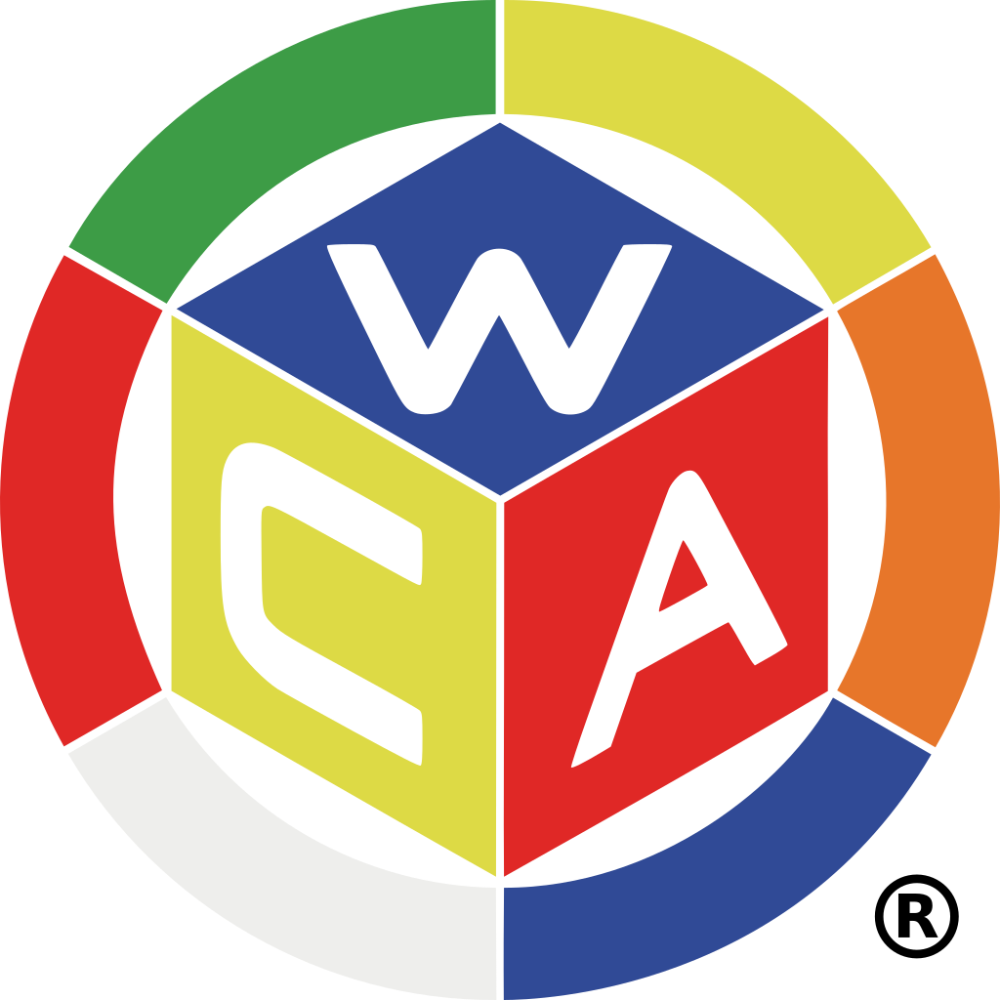

<h1 align="center">World Cube Association Website</h1>

  

 

  **All of the code that runs on [worldcubeassociation.org](https://www.worldcubeassociation.org/).**

 

----

## Joining WST

Our code is open-source, and you are free to submit changes without being part of the WCA Software Team (WST) - just leave a comment indicating interest on any issue you want to work on.

If you would like to join WST, we currently have open positions on the volunteer team - please feel free to [submit an application](https://docs.google.com/document/d/1_uZzs4r8Rvjvvd9z9-IzxHqnXcpC7FKuUvKJaqVs8DY/edit?tab=t.0#heading=h.e9pxlxygjaql)!

## Common Queries
- [Overview of the WCA's software ecosystem](https://docs.worldcubeassociation.org/)
- [Running the website locally](https://docs.worldcubeassociation.org/contributing/quickstart)
- [Contributing Guide](https://docs.worldcubeassociation.org/contributing/detailed_contributing_guide.html)
- [Unofficial API\* to read data from the website](https://wca-rest-api.robiningelbrecht.be/)
- [Other WCA Repos](https://docs.worldcubeassociation.org/#wca-software-resources)
- [Using OAuth, or writing data to the website](https://docs.worldcubeassociation.org/knowledge_base/v0_api.html)

## \*Unofficial API

If you want to query WCA data via an API, the [Unofficial API](https://wca-rest-api.robiningelbrecht.be/) is the best way to do this. It is not developed or supported by WST, but it makes use of the results export and updates daily, so you can rely on the information it provides.

----

If the above links don't give you what you need, feel free to open an issue or [contact us](https://www.worldcubeassociation.org/contact)
